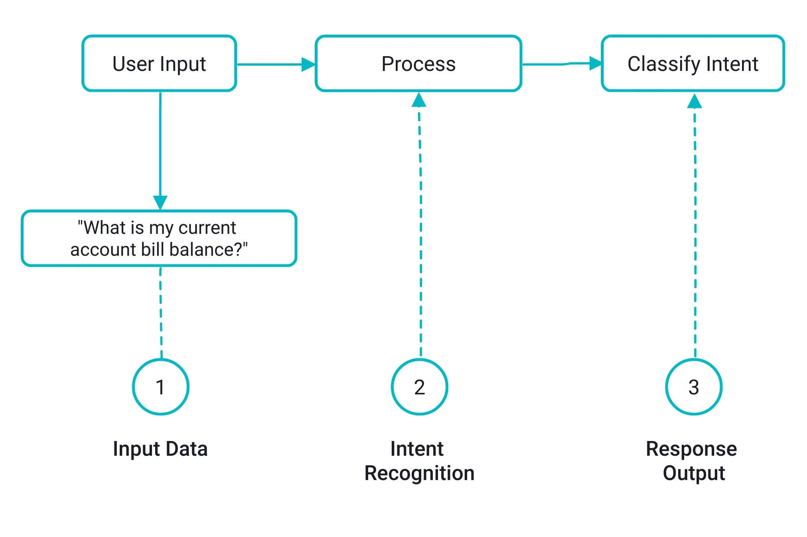

[](
https://nbviewer.org/github/RadyaSRN/intent-classification-for-QA-chatbot/blob/main/notebooks/intent_classification.ipynb)
[](
https://www.kaggle.com/kernels/welcome?src=https://github.com/RadyaSRN/intent-classification-for-QA-chatbot/blob/main/notebooks/intent_classification.ipynb)
[](
https://colab.research.google.com/github/RadyaSRN/intent-classification-for-QA-chatbot/blob/main/notebooks/intent_classification.ipynb)
[](
https://wandb.ai/radyasrn-mipt/NLP-spring-2025/reports/intent-classification-for-QA-chatbot--VmlldzoxNDI1MzExMg)

# Intent Classification for QA Chatbot
Classification of user intents in their requests to the university QA chatbot using the **[RuBERT](https://huggingface.co/DeepPavlov/rubert-base-cased) model**, its modifications, and various techniques.



### Sentiment analysis dataset
For model training the **[dataset](https://www.kaggle.com/datasets/constantinwerner/qa-intents-dataset-university-domain)** of the Novosibirsk State University was used for training.

### Usage
* The first option is to open and run the notebook `/notebooks/intent_classification.ipynb` with comments and visualizations in Kaggle or Google Colab.

* The second option is cloning the repo, installing the needed requirements, and working locally:
```
git clone https://github.com/RadyaSRN/intent-classification-for-QA-chatbot.git
cd intent-classification-for-QA-chatbot
conda create -n intentclassify python=3.10
conda activate intentclassify
pip install -r requirements.txt
```
